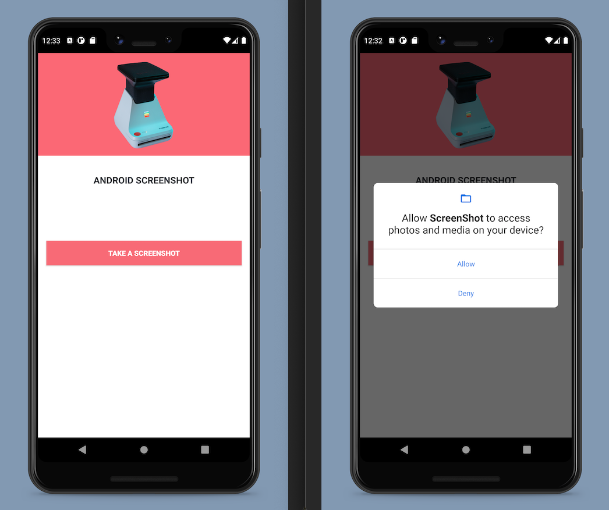

# Android Screenshot

## About The Project

This Java Android project looked at how to take a screenshot programmatically from within an application.

Both the **READ_EXTERNAL_STORAGE** & **WRITE_EXTERNAL_STORAGE** permissions are requested by the user in the main activity.

Once permission has been granted, the button's on click listener can be invoked to capture the screenshot.

## App Screenshots

## Built With

* [Kotlin: 1.5.10](https://kotlinlang.org/)
* [Android Studio: 4.2](https://developer.android.com/studio)
* [Android Lollipop: (5.0)](https://www.android.com/intl/en_uk/versions/lollipop-5-0/)
* [Android 5.0: (API level 21)](https://developer.android.com/about/versions/lollipop)

## Prerequisites

* [Kotlin: 1.5.10](https://kotlinlang.org/)
* [Android Studio: 4.2](https://developer.android.com/studio)
* [Android Lollipop: (5.0)](https://www.android.com/intl/en_uk/versions/lollipop-5-0/)
* [Android 5.0: (API level 21)](https://developer.android.com/about/versions/lollipop)

## License

Distributed under the MIT License. See `LICENSE` for more information.

## Contact

- [Email](mailto:aymerjames@gmail.com)
- [Linkedin](https://uk.linkedin.com/in/jamesaymer)
- [Github](https://github.com/JaymoAymer)

## Acknowledgements
* [Android Developer Documentation: Take a screenshot](https://developer.android.com/studio/debug/am-screenshot)
* [Geek For Geeks: How to take a screenshot programmatically in Android?](https://www.geeksforgeeks.org/how-to-take-screenshot-programmatically-in-android/)